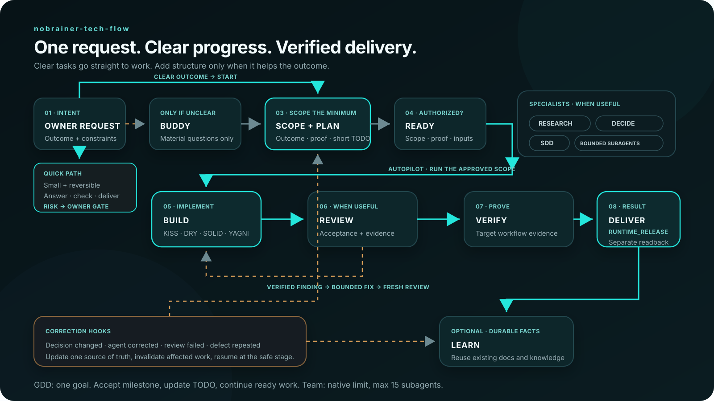
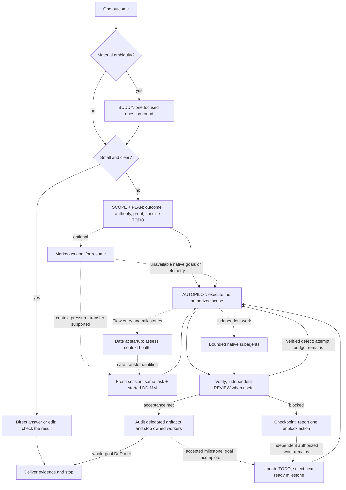

<p align="center">
  <a href="https://nobrainer.tech">
    
  </a>
</p>

<h1 align="center">nobrainer-tech-flow</h1>

<p align="center">
  From task to done.
</p>

<p align="center">
  <a href="https://github.com/nobrainer-tech/nobrainer-tech-flow/actions/workflows/validate.yml"></a>
  <a href="LICENSE"></a>
</p>

<p align="center">
  <a href="https://nobrainer.tech">NoBrainer.tech</a>
  ·
  <a href="https://nobrainer.tech/flow/">Flow overview</a>
  ·
  <a href="https://nobrainertech.gumroad.com">Production-ready agentic workflows</a>
</p>

Tell nobrainer-tech-flow what you need. It clarifies the goal, does the work, and checks the result.

Say **“Use nobrainer-tech-flow”** (or invoke the technical entrypoint `$nobrainer-ultra`) to fix code, prepare
an everyday document, or investigate a problem. Clear tasks go straight to execution;
meaningful ambiguity gets one focused question round. Done means the agreed
criteria are met and the result is checked. A real blocker is reported with the
next unblock action.

A quick answer stays a quick answer. The model-neutral workflow uses one plan,
bounded corrective attempts and a Markdown checkpoint for longer work. Native
goals, telemetry, subagents and client-specific tools are optional.

New public source links and checkout paths use `nobrainer-tech-flow`. Existing
installations keep the legacy technical `nobrainer-tech-skills` package/plugin ID
and all skill commands until a separate compatibility migration. See the
[Flow migration guide](docs/MIGRATION_TO_FLOW.md) and [naming map](docs/NAMING.md).

[Source-backed comparison decisions](docs/reviews/2026-09-05-flow-coverage.md)
cover the current collected Trending snapshot and explain what we adopted or retained.

## Try one real task

[Install safely](#install-safely), start a fresh session, then give the agent a
small task with a checkable result:

> Use nobrainer-tech-flow. Fix one bug in this project. Reproduce it first, make the
> smallest correction and run the relevant check. Tell me what changed and
> what remains unverified. Ask only if a missing decision changes the result.

Prefer a non-coding trial? [Try an invitation, a small code fix or a bounded
command](docs/TRY_IT.md). The guide gives explicit acceptance criteria so you
can judge your own result. These are trials, not promised benchmark scores.

## Install safely

Clone a reviewed ref, validate it, preview exact targets, then apply:

```bash
(
  set -u
  : "${NB_REVIEWED_COMMIT:?set a reviewed full 40-character commit SHA}"
  test "${#NB_REVIEWED_COMMIT}" -eq 40 || exit 2
  case "$NB_REVIEWED_COMMIT" in *[!0-9a-f]*) exit 2 ;; esac
  git clone --no-checkout https://github.com/nobrainer-tech/nobrainer-tech-flow.git || exit 3
  cd nobrainer-tech-flow || exit 3
  git checkout --detach "$NB_REVIEWED_COMMIT" || exit 3
  test "$(git rev-parse HEAD)" = "$NB_REVIEWED_COMMIT" || exit 3
  python3 scripts/validate_skills.py --suite || exit 4
  python3 scripts/install_skills.py --client codex || exit 4
  python3 scripts/install_skills.py --client codex --apply || exit 4
)
```

Set `NB_REVIEWED_COMMIT` to the exact full commit SHA you reviewed. Tags and
branches are rejected because they can move; every failed gate stops before the
next command.

The installer defaults to all seventeen canonical skills, supports an exact
subset, refuses foreign targets and can use links or copies. Restart the client
and perform clean-session discovery before claiming runtime installation. Full
client-specific steps and rollback are in [Installation](docs/INSTALL.md).




### GitHub flow chart



## Astra Ready Flow, portable by design

Version **1.6** removes client-specific prerequisites from ordinary work.
OpenAI [introduced GPT-6 Astra](https://openai.com/index/gpt-6-astra/) on
September 3, 2026. The suite keeps the host-selected model and uses the same
plain-text instructions with other models; it does not pin a provider or choose
an expensive tier automatically.

[Compatibility](docs/COMPATIBILITY.md) separates available models, tested
behavior, client loading and source distribution. Local smoke evidence covers
only its recorded source and scenarios. It is not a universal compatibility,
quality or token-savings benchmark.

The [1.6.1 instruction review](docs/reviews/2026-09-05-astra-instructions.md)
clarifies user authority, skill-caused pauses and when verification is sufficient.
The same rules apply across models; historical runtime proof stays tied to the
tested release bytes.

```text
Small task       -> direct result + relevant check
Larger task      -> clarify if needed + short TODO + execute + verify
Resumable task   -> same workflow + one Markdown goal/checkpoint
Independent work -> optional bounded subagents, audited before integration
```

Load specialists only when needed. Reuse the project's instructions, tests,
specs and wiki. Choose SDD for durable contracts and TDD when a failing test
would expose the behavior; neither requires installing a framework.
See the [v1.6 review and research decisions](docs/reviews/v1.6.0-review.md).

## Start with one skill

Use nobrainer-tech-flow, implemented by the technical skill
[`nobrainer-ultra`](skills/nobrainer-ultra/), for setup or any non-trivial
outcome. A small reversible edit without a public contract, routing, workflow or
portfolio change can use its quick path; other changes use the full path and its
coherence gate.
In Codex, the technical explicit invocation is `$nobrainer-ultra`. `nb-flow`,
`nb-ultra` and `nb-workflow` remain compatibility trigger phrases only and
depend on a client's implicit description matching.

```text
DRIFT_CHECK -> BUDDY -> SCOPE -> AUTOPILOT -> VERIFY -> RECEIVE_AUDIT -> LEARN
```

- `BUDDY` is the first and only ordinary clarification stage.
- `SCOPE` freezes outcome, non-goals, expected files, proof, untouched work,
  minimum solution, test decision and clean completion before a non-trivial write.
- One canonical plan owns TODO state; the owner sees only a compact Progress
  checklist and one next action.
- A durable ledger adds exact identity, dependencies, checkpoints, retries and
  rollback only for cross-session, dependency-rich or consequential work.
- `AUTOPILOT` continues through routine approved work without repeated check-ins.
- `nobrainer-team` selects the minimum useful capabilities;
  `nobrainer-dispatcher` schedules only approved ready work in bounded batches;
  `nobrainer-sessions` creates or reuses exact visible sessions only when
  parallelism, isolation, handoff or independent evidence earns the cost.
- Failed review returns to `nobrainer-build`; changed code invalidates old proof.
- Merge, deploy, publishing, spending, credentials, destructive operations and
  production mutation remain owner gates unless exact authority is already
  recorded.

The two execution axes stay independent:

```text
CONTROL_MODE: BUDDY -> AUTOPILOT
SESSION_MODE: MAIN | MULTI_SESSION
```

For resumable or delegated work, `SESSION_HEALTH_GATE` uses available,
configured limits. Missing optional telemetry lowers the health claim and still
allows bounded safe work. An explicitly required hard budget must be enforceable.
`RUNTIME_RELEASE` concerns actual task-owned workers; a completed result does not
prove they stopped. `GOAL_FILE` is optional Markdown recovery state. A native goal
is used only when available and authorized; the file alone suffices.

Autopilot works in one MAIN session. Native subagents need a scoped assignment,
observable completion and reviewed output. Use persistent sessions and a
Dispatcher only when a real handoff or dependent queue needs them.

## Seventeen skills, distinct ownership

Aliases are compatibility trigger phrases, not product names or duplicate
directories. Each skill owns one
recurring boundary:

| Skill | Alias | Responsibility |
|---|---|---|
| [`nobrainer-ultra`](skills/nobrainer-ultra/) | `nb-flow`, `nb-ultra` | Technical Flow entrypoint for end-to-end setup and delivery: one requirements gate, concise progress, bounded execution, recovery, audit and learning |
| [`nobrainer-codex-context`](skills/nobrainer-codex-context/) | `nb-codex-context` | Project-local Codex context setup: instruction discovery, fallback and byte-budget audit, safe context block reconciliation and runtime readback |
| [`nobrainer-skill-doctor`](skills/nobrainer-skill-doctor/) | `nb-skill-doctor` | Cross-project audit of skills, project instructions and task prompts: trigger overlap, excessive process, coverage and minimal portfolio repair planning |
| [`nobrainer-team`](skills/nobrainer-team/) | `nb-team` | Minimal capability roster, installed-skill inventory and safe temporary specialist discovery |
| [`nobrainer-dispatcher`](skills/nobrainer-dispatcher/) | `nb-dispatcher` | Dependency-aware ready-set scheduling, bounded dispatch, backpressure and audited result routing |
| [`nobrainer-research`](skills/nobrainer-research/) | `nb-research` | Bounded current research from primary sources with facts separated from inference |
| [`nobrainer-writing`](skills/nobrainer-writing/) | `nb-write`, `nb-brief` | High-signal drafting, compression and short human-sounding comments, issues and stories that preserve meaning, evidence, voice and action |
| [`nobrainer-build`](skills/nobrainer-build/) | `nb-build` | Smallest verified implementation using calibrated KISS, DRY, SOLID, YAGNI and anti-slop gates |
| [`nobrainer-security`](skills/nobrainer-security/) | `nb-security` | Threat models, security review, supply-chain audit and high-risk release evidence |
| [`nobrainer-sessions`](skills/nobrainer-sessions/) | `nb-sessions` | Named visible sessions, exact identity, isolated writers, audited handoff, lease and recovery |
| [`nobrainer-spec-driven-development`](skills/nobrainer-spec-driven-development/) | `nb-sdd` | Durable specification and acceptance ledger when contracts, risk or resumability justify it |
| [`nobrainer-wiki`](skills/nobrainer-wiki/) | `nb-wiki` | Targeted retrieval and sourced durable knowledge without hidden memory or live task state |
| [`nobrainer-browser`](skills/nobrainer-browser/) | `nb-browser` | Playwright-first rendered inspection, bounded CDP profile restart, approved session attach, browser tests and trace evidence |
| [`nobrainer-autoimprove`](skills/nobrainer-autoimprove/) | `nb-autoimprove` | Measured baseline/variant/eval/holdout improvement with keep-or-revert |
| [`nobrainer-decide`](skills/nobrainer-decide/) | `just decide` / `just-decide` / `decide` / `nb-decide` / `nobrainer-decide` / `deep decide` / `deep-decide` | Quick, standard or deep decisions; feasibility, reliability, total cost, delivery time and practical growth before commitment |
| [`nobrainer-rca`](skills/nobrainer-rca/) | `nb-rca` | Read-only causal diagnosis with a continuous evidence chain and explicit uncertainty |
| [`nobrainer-review`](skills/nobrainer-review/) | `nb-review` | Acceptance trace, adversarial bug hunt and release close gate without speculative findings |

The [curation audit](docs/SKILL_CURATION.md) records why each skill exists and
what belongs in another skill instead of becoming an unnecessary trigger.

## SDD and GDD

SDD specifies what must work. GDD (Goal-Driven Development) executes it through
accepted milestones under one overarching goal. See the [product specification](docs/specs/goal-driven-delivery.spec.md).

For substantial work, `nobrainer-tech-flow` derives the outcome and DoD and keeps
one task owner without waiting for a separate planning request. Native goal
creation still follows the host's explicit-request requirement. Autopilot checks
available authorized UI/API/CLI steps before handing an obstacle to the owner,
continues independent work, and bounds review to concrete executable slices.
Explicit `yolo` requests select the same persistence contract, without changing
permissions or bypassing a denial. See the [delivery contract](skills/nobrainer-ultra/references/delivery.md).
These are agent instructions, not an enforcement daemon or a promise to run
while the host is paused or out of quota.

## Correct once, improve permanently

nobrainer-tech-flow contains portable semantic hooks for four events:

- `OWNER_DECISION_CHANGED` updates the canonical decision, marks the old value
  superseded and invalidates dependent TODO items and evidence;
- `AGENT_ERROR_CORRECTED` fixes the active result and classifies one minimal
  prevention candidate: `AUTO_SCOPED` may persist it to one governed canonical
  project-local store, `ASK` prepares one exact diff, and `OFF` keeps it
  task-local without a durable diff;
- `REVIEW_FAILED` creates a bounded Build correction and sends fresh evidence
  back to Review;
- `REPEATED_DEFECT` stops blind retries and invokes RCA with the prior failure
  fingerprint.

Only durable, sourced, authorized and non-secret knowledge is promoted through
`nobrainer-wiki`. One mutable fact has one canonical owner; the system does not
append contradictory copies to the plan, instructions and wiki.
Project setup records `LEARNING_WRITE_POLICY: AUTO_SCOPED | ASK | OFF`, so an
owner can enable automatic project-local learning without granting global or
publishing authority.

## Quality without AI slop

The shared delivery contract operationalizes:

- `KISS`: the simplest complete design wins;
- `YAGNI`: no speculative extension points or future options;
- `DRY`: deduplicate owned knowledge and state, not incidental similarity;
- `SOLID`: cohesive responsibilities and stable boundaries without class or
  interface ceremony;
- evidence: no invented APIs, fake runtime claims, placeholder logic, swallowed
  errors, generic prose, broad unrelated rewrites or mock-only confidence;
- content quality: purpose, audience, correctness sources, completeness,
  coherence and target-workflow usefulness are frozen before execution.

If a decision-relevant fact may be current, niche, uncertain, high-stakes or
source-attributed, nobrainer-tech-flow routes the smallest sufficient check through Research.
A stable local syntax, import, test or configuration error starts from local
evidence instead of an automatic wiki/web detour. If required primary evidence
is unavailable, it says `RESEARCH_BLOCKED` instead of guessing.

## Compatibility is a proof ladder

All clients consume the same `skills/` tree. Thin adapters cover Claude Code,
Codex, Cursor, OpenCode, Gemini CLI, Kimi Code and Pi; the portable Agent Plugin
manifest and project instructions are the fallback for other Agent Skills
consumers.

Compatibility claims use five distinct levels:

```text
SOURCE_VALIDATED -> REPOSITORY_CHECKED -> CLIENT_LOADED
                 -> RUNTIME_VERIFIED -> DISTRIBUTED
```

A valid manifest does not prove clean-session routing. A local test does not
prove production. See [Compatibility](docs/COMPATIBILITY.md) for current proof
and [Testing](docs/TESTING.md) for acceptance evidence.


Current source candidate version: **1.13.0**. Check the
[latest published GitHub release](https://github.com/nobrainer-tech/nobrainer-tech-flow/releases/latest)
for distribution and the [v1.13.0 candidate record](docs/releases/v1.13.0.md) for
the candidate scope and preserved installation identities. The unchanged command runner keeps its
[v1.7.0 verification scope](docs/releases/v1.7.0.md). Source publication does not
imply client marketplace discovery or improved model reasoning. The earlier
[v1.6.1 publication readback](docs/releases/v1.6.1-publication-readback.md)
remains historical evidence.

Version [`v1.5.0`](docs/releases/v1.5.0-publication-readback.md) remains an
accepted rollback source release. Its historical pre-publication checkpoint is
[`docs/releases/v1.5.0.md`](docs/releases/v1.5.0.md).

Version [`v1.4.0`](docs/releases/v1.4.0-publication-readback.md) remains the
previous accepted source release and rollback option. Client-specific runtime
rows remain evidence-scoped; source publication does not imply marketplace
discovery.

The [`v1.3.1` release](docs/releases/v1.3.1-publication-readback.md) remains the
previous accepted source release and a rollback option. It adds the English
`BRIEF` writing mode, concise issue/story templates and surface-specific bug
evidence.

The [`v1.3.0` release](docs/releases/v1.3.0-publication-readback.md) remains an
older accepted source release and rollback option.

Version [`v1.2.1`](docs/releases/v1.2.1.md) remains the rollback source release
at full commit `0010140d19a7ff847dff776569772ef04d82c314`, with its own exact
tag, archive and isolated-install evidence. To reproduce the reviewed v1.3.0
source:

```bash
git checkout --detach 8ae4a26548ce908fc5f98b22663f52e163541f56
test "$(git rev-parse HEAD)" = "8ae4a26548ce908fc5f98b22663f52e163541f56"
python3 scripts/validate_skills.py --suite
python3 -m unittest discover -s tests -q
```

`v1.2.0` remains published but failed archive acceptance; its exact boundary is
[recorded separately](docs/releases/v1.2.0.md). GitHub reports the `v1.2.1`
release object as non-immutable and tag protection was not independently
verified, so security-sensitive consumers should pin the full commit SHA. The
current tag archive was re-read after the metadata-only history rewrite and
passed 88/88 tests; historical CI binds the same tree, not the current commit
identity.
[`v1.1.0`](docs/releases/v1.1.0.md) remains the accepted rollback anchor at full
commit `711be31d654835a04ef8c70674c3e493aeb2da8a`.

## One source, thin adapters

```text
skills/               canonical portable behavior
adapters/bootstrap.md small session-start route to nobrainer-tech-flow
hooks/                tested client lifecycle adapters
scripts/              validation and conflict-safe installation
tests/                deterministic and behavior-contract gates
docs/                 compatibility, curation, eval and release evidence
assets/               brand and workflow diagrams
```

Client-specific forks of a skill are prohibited. External skills discovered by
Team are untrusted input: inspect the exact source/ref, instructions, scripts,
permissions, network/credential behavior, trigger overlap and rollback. Prefer
temporary project-scoped use; persistent or global installation is an owner
gate.

## Attribution

- `nobrainer-autoimprove` is an independent adaptation of Andrej Karpathy's
  [autoresearch](https://github.com/karpathy/autoresearch) measure-change-keep
  loop.
- `nobrainer-wiki` is an independent adaptation of Andrej Karpathy's
  [LLM wiki concept](https://gist.github.com/karpathy/442a6bf555914893e9891c11519de94f).
- Other external design sources remain cited inside the exact skill where they
  influenced a behavior contract.

## Contributing and security

Read [CONTRIBUTING.md](CONTRIBUTING.md), [SECURITY.md](SECURITY.md) and
[RELEASE-NOTES.md](RELEASE-NOTES.md). Every change goes through a focused PR,
pressure scenario, validators, diff review and secret scan. Do not report
publication, distribution, live routing or user-visible success without
readback from that layer.

NoBrainer.Tech builds practical agentic workflows for teams that want speed
without surrendering control. Learn more at [nobrainer.tech](https://nobrainer.tech)
or browse ready-to-use workflow products on
[Gumroad](https://nobrainertech.gumroad.com).

## Adaptive session restart

On explicit nobrainer-tech-flow task invocation, Flow immediately names the conversation
`<task title> | started DD-MM` using its verified creation date and preserves it
on resume. It assesses context before work, after compaction and at accepted
milestones. Adaptive care uses recorded task authority and respects `off` and
stricter host rules; installing the package alone enables no session mutation.

A pressured session with a materially smaller full startup can rotate even when
token payback is unknown. Age and compaction count alone do not force rotation.
Flow preserves progress in the task file, verifies successor takeover and archives
the source only when authorized. The full timestamp, timezone and exact session
ID stay authoritative. Unsupported clients receive an explicit manual handoff.

This belongs to [Sessions](skills/nobrainer-sessions/references/session-restart.md),
not a separate skill. The optional stdlib [decision helper](skills/nobrainer-sessions/scripts/restart_gate.py)
can serve a client hook without requiring one. Automatic startup care is development source on top of
v1.8.1; native transport and all-client savings are not implied. Published tags
remain unchanged. See [session restart](docs/SESSION_RESTART.md).
