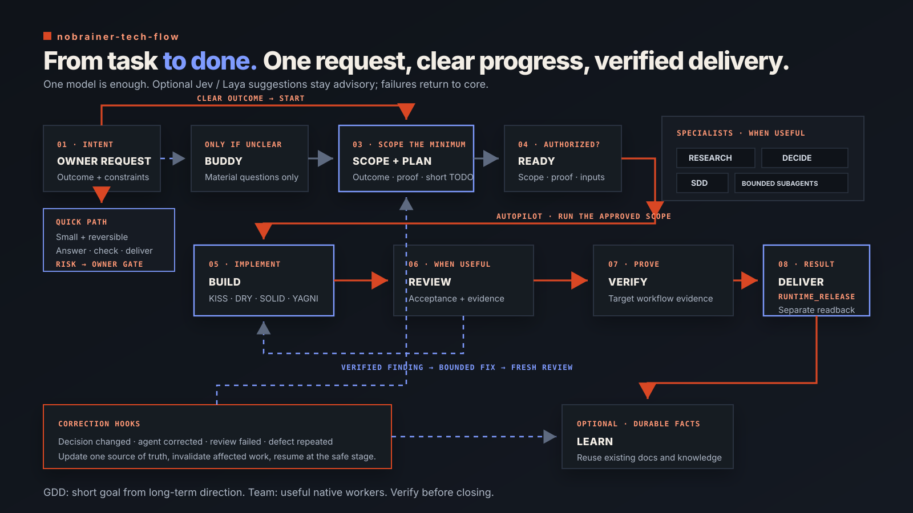
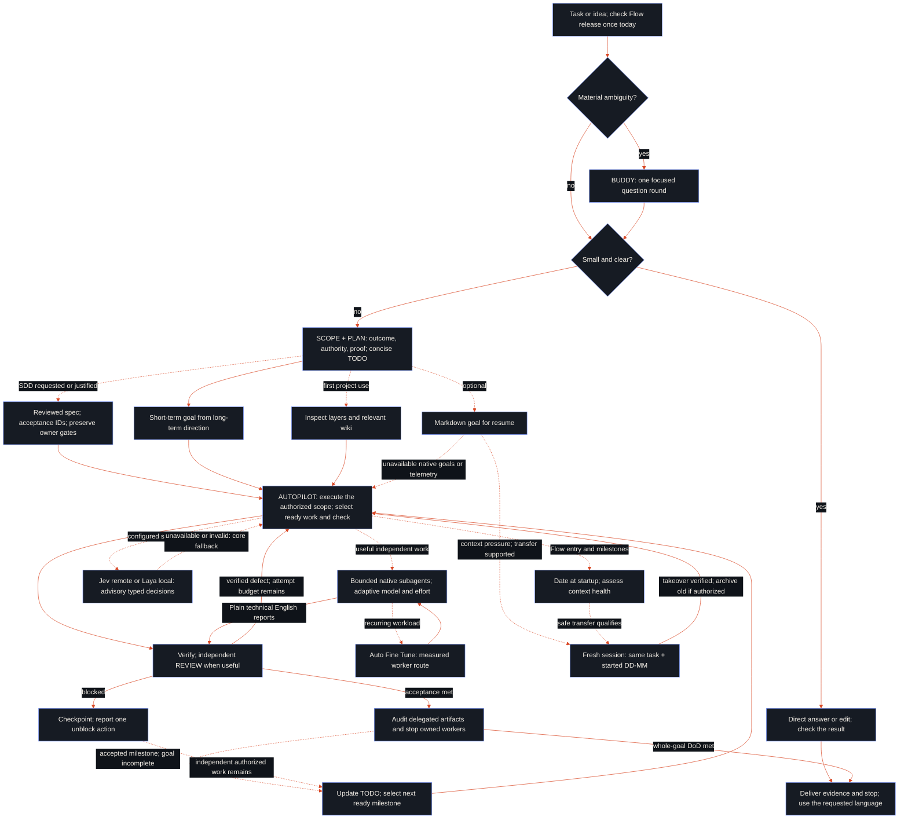

<p align="center">
  <a href="https://nobrainer.tech">
    
  </a>
</p>

<h1 align="center">nobrainer-tech-flow</h1>

<p align="center">
  <strong>From task to done.</strong><br>
  One AI workflow for coding agents,<br>
  instead of 50+ separate tools.
</p>

<p align="center">
  <a href="https://github.com/nobrainer-tech/nobrainer-tech-flow/actions/workflows/validate.yml"></a>
  <a href="LICENSE"></a>
</p>

<p align="center">
  <a href="https://nobrainer.tech/flow/">Launch page</a>
  ·
  <a href="#install-safely">Copy the setup prompt</a>
  ·
  <a href="https://nobrainer.tech/flow/compare/">Compare 50+ tools</a>
  ·
  <a href="https://nobrainer.tech/flow/deep-dive/">Deep dive</a>
  ·
  <a href="https://www.producthunt.com/products/nobrainer-tech-flow">Product Hunt</a>
</p>

<table>
  <tr>
    <td width="50%" align="center" valign="top">
      <a href="https://nobrainer.tech/flow/assets/flow-reel-universal-1x1.mp4"><picture><source media="(prefers-reduced-motion: reduce)" srcset="https://nobrainer.tech/flow/assets/flow-reel-universal-poster-1x1.png"></picture></a><br>
      <strong>Why?</strong> 50+ tools you could piece together, or one workflow.<br>
      <a href="https://nobrainer.tech/flow/assets/flow-reel-universal-1x1.mp4">Watch with sound (20 s)</a>
    </td>
    <td width="50%" align="center" valign="top">
      <a href="https://nobrainer.tech/flow/assets/flow-done-v2-1x1.mp4"><picture><source media="(prefers-reduced-motion: reduce)" srcset="https://nobrainer.tech/flow/assets/flow-done-v2-poster-1x1.png"></picture></a><br>
      <strong>Done?</strong> What was delivered, the proof, what was not checked.<br>
      <a href="https://nobrainer.tech/flow/assets/flow-done-v2-1x1.mp4">Watch with sound (30 s)</a>
    </td>
  </tr>
</table>

<p align="center">
  Ships adapters for
  <a href="https://github.com/openai/codex">Codex</a>,
  <a href="https://code.claude.com/docs">Claude Code</a>,
  <a href="https://cursor.com/">Cursor</a>,
  <a href="https://github.com/features/copilot/cli">GitHub Copilot CLI</a>,
  <a href="https://opencode.ai/">OpenCode</a>,
  <a href="https://github.com/google-gemini/gemini-cli">Gemini CLI</a>,
  <a href="https://www.kimi.com/code">Kimi Code</a> and
  <a href="https://pi.dev/">Pi</a>.
  See the <a href="docs/COMPATIBILITY.md">per-client compatibility evidence</a> for what has been loaded and tested.
</p>

Start with a task or just an idea. nobrainer-tech-flow clarifies what matters, does the work, and checks the result.

In **2.1.1**, agents use plain technical English for operational exchanges by
default. You receive clear answers directly in your requested language, with
commands, conditions and evidence kept intact. Explicit language and style
requests still apply. See the [communication policy](skills/nobrainer-tech-flow/references/communication.md).

Writing defaults to [plain technical English](skills/nobrainer-writing/references/plain-technical-english.md) for English technical artifacts:
clear steps and consistent terms while keeping exact commands, conditions and uncertainty.
The mode is informed by ASD-STE100; it does not claim full standard compliance.

## How it works



Small, clear tasks take the quick path. Larger work is scoped, carried through and verified, and the handoff says what was delivered, what was checked and what is left for you to decide.

For an idea, [SDD](skills/nobrainer-tech-flow/references/idea-to-delivery.md)
turns the agreed scope into a spec and checkable acceptance criteria. Ask for
end-to-end delivery, and those criteria stay attached to execution and evidence.
Routine choices need no extra prompt; material unknowns stay visible.
[Try idea to delivery](docs/TRY_IT.md#from-an-idea-to-a-working-result).

For a supplied or generated plan, [autopilot](skills/nobrainer-tech-flow/references/autopilot.md)
works through ready tasks, checks each result, corrects confirmed defects and
continues to the whole goal. Blocked work stays visible while independent tasks
advance. [Try a small approved plan](docs/TRY_IT.md#carry-an-approved-plan-through-autopilot).

<details>
<summary><strong>The workflow in detail</strong></summary>

New AI skills, workflows and add-ons keep arriving. nobrainer-tech-flow curates
the useful parts into one maintained path from task to a checked finish.

Say **“Use nobrainer-tech-flow”** (or invoke the technical entrypoint `$nobrainer-tech-flow`) to fix code, prepare
an everyday document, or investigate a problem. Clear tasks go straight to execution;
meaningful ambiguity gets one focused question round. Done means the agreed
criteria are met and the result is checked. A real blocker is reported with the
next unblock action.

A quick answer stays a quick answer. The model-neutral workflow uses one plan,
bounded corrective attempts and a Markdown checkpoint for longer work. Native
goals, telemetry, subagents and client-specific tools are optional.

**One model is enough.** Optional Jev (remote) and Laya (local) profiles add
typed suggestions for bounded classification, ranking and evaluation. Setup
remembers your choice; the default makes no provider calls. Missing access or
failed requests return to the core workflow. See [setup and usage](skills/nobrainer-tech-flow/references/optional-decisions.md)
for configuration, data approval and tested platform limits.

Team checks whether a task has the capabilities it needs. Research records
which sources were actually checked; Build names any known limit in an
accepted simplification. The current task stays central while specialist
tools remain optional.

New source links, public package/plugin IDs and checkout paths use
`nobrainer-tech-flow`. Existing installations with the previous
`nobrainer-tech-skills` ID need the reviewed migration path; an installed
legacy package does not automatically become the new package. See the
[Flow migration guide](docs/MIGRATION_TO_FLOW.md) and [naming map](docs/NAMING.md).

### GitHub flow chart


```mermaid
%%{init: {'theme': 'base', 'themeVariables': {'primaryColor': '#161B23', 'primaryTextColor': '#F3EEE6', 'primaryBorderColor': '#7F9BFF', 'lineColor': '#D94724', 'secondaryColor': '#0F1319', 'tertiaryColor': '#0F1319', 'fontFamily': 'Inter, system-ui, sans-serif'}}}%%
flowchart TD
    A[Task or idea; check Flow release once today] --> B{Material ambiguity?}
    B -->|yes| C[BUDDY: one focused question round]
    B -->|no| D{Small and clear?}
    C --> D
    D -->|yes| E[Direct answer or edit; check the result]
    D -->|no| F[SCOPE + PLAN: outcome, authority, proof; concise TODO]
    F --> S[Short-term goal from long-term direction]
    F -. SDD requested or justified .-> U[Reviewed spec; acceptance IDs; preserve owner gates]
    U --> G
    S --> G[AUTOPILOT: execute the authorized scope; select ready work and check]
    G --> H[Verify; independent REVIEW when useful]
    H -->|verified defect; attempt budget remains| G
    H -->|acceptance met| I[Audit delegated artifacts and stop owned workers]
    H -->|blocked| J[Checkpoint; report one unblock action]
    E --> K[Deliver evidence and stop; use the requested language]
    I -->|whole-goal DoD met| K
    I -. accepted milestone; goal incomplete .-> P[Update TODO; select next ready milestone]
    P --> G
    J -. independent authorized work remains .-> P
    F -. optional .-> L[Markdown goal for resume]
    G -. useful independent work .-> M[Bounded native subagents; adaptive model and effort]
    G -. configured shadow only .-> Q[Jev remote or Laya local: advisory typed decisions]
    Q -. unavailable or invalid: core fallback .-> G
    M -->|Plain technical English reports| H
    F -. first project use .-> R[Inspect layers and relevant wiki]
    R --> G
    M -. recurring workload .-> T[Auto Fine Tune: measured worker route]
    T --> M
    L -. context pressure; transfer supported .-> N[Fresh session: same task + started DD-MM]
    N -->|takeover verified; archive old if authorized| G
    G -. Flow entry and milestones .-> O[Date at startup; assess context health]
    O -. safe transfer qualifies .-> N
    L -. unavailable native goals or telemetry .-> G
```

</details>

## Install safely

1. Paste this into your coding agent, whichever it is. The same prompt installs and updates, and
   the default install works on macOS, Linux and Windows without Python:

   ```text
   Install nobrainer-tech-flow from https://github.com/nobrainer-tech/nobrainer-tech-flow
   for the coding agent you are, or update it if it is already installed.

   1. Keep a copy in ~/.nobrainer-tech-flow: clone the repository there, or run
      git pull there if it already exists. Do not delete that folder later; the
      skills link to it.
   2. Read the install section of its README and follow the method it gives for
      your client and operating system (docs/INSTALL.md has the details).
   3. Preview first and show me what will change. Apply only after I agree, and
      do not edit my files beyond what that method does.
   4. Tell me the undo command, and whether I need to restart you.
   ```

   Or run it yourself in a terminal (on Windows, in Git Bash):

   ```sh
   git clone https://github.com/nobrainer-tech/nobrainer-tech-flow ~/.nobrainer-tech-flow
   sh ~/.nobrainer-tech-flow/scripts/install.sh --client claude           # preview: changes nothing
   sh ~/.nobrainer-tech-flow/scripts/install.sh --client claude --apply   # link the skills, add the block
   ```

   `--client` is `claude`, `codex`, `opencode` or `copilot`. Cursor, Gemini CLI, Pi and Kimi Code
   take Flow as a plugin or extension instead: see their sections in
   [docs/INSTALL.md](docs/INSTALL.md#client-channels). The script links all eighteen skills and adds
   one instruction block, shows the exact text first, refuses anything that is not its own, grants
   no authorization and undoes itself with `--undo --apply`. To update, run `git pull` in
   `~/.nobrainer-tech-flow` and the same two commands again, or paste the prompt again. With Python,
   `python3 scripts/install.py` takes the same flags.

   For Claude Code, you can choose a plugin installation from a checkout you have reviewed:

   ```sh
   claude plugin marketplace add ~/.nobrainer-tech-flow
   claude plugin install nobrainer-tech-flow@nobrainer-tech
   ```

   The plugin entry point is `/nobrainer-tech-flow:nobrainer-tech-flow`. See
   [Claude Code installation](docs/INSTALL.md#claude-code) and the
   [compatibility evidence](docs/COMPATIBILITY.md#current-source-readback-2026-09-29)
   for the tested client versions and limits; installing the package does not prove automatic routing.
2. In a fresh session, give it one small task with a checkable result:

> Use nobrainer-tech-flow. Fix one bug in this project. Reproduce it first, make the
> smallest correction and run the relevant check. Tell me what changed and
> what remains unverified.

More first tasks, with acceptance criteria: [docs/TRY_IT.md](docs/TRY_IT.md). These are trials, not promised benchmark scores.

<details>
<summary><strong>Install manually from a reviewed commit</strong></summary>

Clone a reviewed ref, validate it, preview what would change, then apply:

```bash
(
  set -u
  : "${NB_REVIEWED_COMMIT:?set a reviewed full 40-character commit SHA}"
  test "${#NB_REVIEWED_COMMIT}" -eq 40 || exit 2
  case "$NB_REVIEWED_COMMIT" in *[!0-9a-f]*) exit 2 ;; esac
  git clone --no-checkout https://github.com/nobrainer-tech/nobrainer-tech-flow.git || exit 3
  cd nobrainer-tech-flow || exit 3
  git checkout --detach "$NB_REVIEWED_COMMIT" || exit 3
  test "$(git rev-parse HEAD)" = "$NB_REVIEWED_COMMIT" || exit 3
  python3 scripts/validate_skills.py --suite || exit 4
  python3 scripts/install.py --client codex || exit 4          # preview: changes nothing
  python3 scripts/install.py --client codex --apply || exit 4  # link the skills, add the block
)
```

Set `NB_REVIEWED_COMMIT` to the exact full commit SHA you reviewed. Tags and
branches are rejected because they can move; every failed gate stops before the
next command.

`install.py`, like `scripts/install.sh` without Python, links all eighteen skills
and adds one managed instruction block for `claude`, `codex`, `opencode` or
`copilot`. The preview shows the exact text it would write, a target that is not
its own link is refused, no authorization is ever granted, and
`python3 scripts/install.py --client codex --undo --apply` reverses it. It needs
symbolic links (Windows: Developer Mode). For a subset, a copy install, the shared
`agents` folder or another client, use the individual scripts in
[Installation](docs/INSTALL.md). Restart the client and perform clean-session
discovery before claiming runtime installation.

</details>

If this workflow helps with a real task, star the repository and follow
[@nobrainer_tech](https://x.com/nobrainer_tech) for build notes and practical examples.

<details>
<summary><strong>Full documentation in this README</strong>: skills, compatibility, attribution, contributing</summary>

<details>
<summary><strong>Astra Ready Flow, portable by design</strong></summary>

Since version **1.6**, ordinary work has no client-specific prerequisites.
OpenAI [introduced GPT-6 Astra](https://openai.com/index/gpt-6-astra/) on
September 3, 2026. The suite keeps the host-selected model and uses the same
plain-text instructions with other models; it does not pin a provider or choose
an expensive tier automatically.

[Compatibility](docs/COMPATIBILITY.md) separates available models, tested
behavior, client loading and source distribution. Local smoke evidence covers
only its recorded source and scenarios. It is not a universal compatibility,
quality or token-savings benchmark.

User authority, transparent pauses and sufficient verification apply across
models. Historical runtime proof stays tied to the tested release bytes.

```text
Small task       -> direct result + relevant check
Larger task      -> clarify if needed + short TODO + execute + verify
Resumable task   -> same workflow + one Markdown goal/checkpoint
Independent work -> capable native workers by default when useful; MAIN audits
```

Load specialists only when needed. Reuse the project's instructions, tests,
specs and wiki. Choose SDD for durable contracts and TDD when a failing test
would expose the behavior; neither requires installing a framework.

</details>

<details>
<summary><strong>Start with one skill</strong></summary>

Use nobrainer-tech-flow through the canonical skill
[`nobrainer-tech-flow`](skills/nobrainer-tech-flow/), for setup or any non-trivial
outcome. A small reversible edit without a public contract, routing, workflow or
portfolio change can use its quick path; other changes use the full path and its
coherence gate.
In Codex, the technical explicit invocation is `$nobrainer-tech-flow`. Say
`Use NBFlow`, `Use NBF` or `Use nobrainer-tech-flow` in natural language;
older trigger phrases are migration context only and
depend on a client's implicit description matching.

```text
DRIFT_CHECK -> BUDDY -> SCOPE -> AUTOPILOT -> VERIFY -> RECEIVE_AUDIT -> LEARN
```

- `BUDDY` is the first and only ordinary clarification stage.
- `SCOPE` freezes outcome, non-goals, expected files, proof, untouched work,
  minimum solution, test decision and clean completion before a non-trivial write.
- One canonical plan owns TODO state; the owner sees only a compact Progress
  checklist and one next action.
- A durable ledger adds exact identity, dependencies, checkpoints, retries and
  rollback only for cross-session, dependency-rich or consequential work.
- `AUTOPILOT` continues through routine approved work without repeated check-ins.
- `nobrainer-team` selects the minimum useful capabilities;
  `nobrainer-dispatcher` schedules only approved ready work in bounded batches;
  `nobrainer-sessions` creates or reuses exact visible sessions only when
  parallelism, isolation, handoff or independent evidence earns the cost.
- Failed review returns to `nobrainer-build`; changed code invalidates old proof.
- Merge, deploy, publishing, spending, credentials, destructive operations and
  production mutation remain owner gates unless exact authority is already
  recorded.

The two execution axes stay independent:

```text
CONTROL_MODE: BUDDY -> AUTOPILOT
SESSION_MODE: MAIN | MULTI_SESSION
```

For resumable or delegated work, `SESSION_HEALTH_GATE` uses available,
configured limits. Missing optional telemetry lowers the health claim and still
allows bounded safe work. An explicitly required hard budget must be enforceable.
`RUNTIME_RELEASE` concerns actual task-owned workers; a completed result does not
prove they stopped. `GOAL_FILE` is optional Markdown recovery state. A native goal
is used only when available and authorized; the file alone suffices.

Autopilot works in one MAIN session. Native subagents need a scoped assignment,
observable completion and reviewed output. Use persistent sessions and a
Dispatcher only when a real handoff or dependent queue needs them.

</details>

<details>
<summary><strong>Eighteen skills, distinct ownership</strong></summary>

Aliases are compatibility trigger phrases, not product names or duplicate
directories. Each skill owns one
recurring boundary:

| Skill | Alias | Responsibility |
|---|---|---|
| [`nobrainer-tech-flow`](skills/nobrainer-tech-flow/) | `NBFlow`, `NBF` | Technical entrypoint for end-to-end setup and delivery: one requirements gate, concise progress, bounded execution, recovery, audit and learning |
| [`nobrainer-auto-fine-tune`](skills/nobrainer-auto-fine-tune/) | `nb-auto-fine-tune` | Read-only capability audit and route calibration: verified host models, effort, context and useful parallelism while MAIN keeps the owner's model |
| [`nobrainer-codex-context`](skills/nobrainer-codex-context/) | `nb-codex-context` | Project-local Codex context setup: instruction discovery, fallback and byte-budget audit, safe context block reconciliation and runtime readback |
| [`nobrainer-skill-doctor`](skills/nobrainer-skill-doctor/) | `nb-skill-doctor` | Cross-project audit of skills, project instructions and task prompts: trigger overlap, excessive process, coverage and minimal portfolio repair planning |
| [`nobrainer-team`](skills/nobrainer-team/) | `nb-team` | Minimal capability roster, installed-skill inventory and safe temporary specialist discovery |
| [`nobrainer-dispatcher`](skills/nobrainer-dispatcher/) | `nb-dispatcher` | Dependency-aware ready-set scheduling, bounded dispatch, backpressure and audited result routing |
| [`nobrainer-research`](skills/nobrainer-research/) | `nb-research` | Bounded current research from primary sources with facts separated from inference |
| [`nobrainer-writing`](skills/nobrainer-writing/) | `nb-write`, `nb-brief` | High-signal drafting, compression and short human-sounding comments, issues and stories that preserve meaning, evidence, voice and action |
| [`nobrainer-build`](skills/nobrainer-build/) | `nb-build` | Smallest verified implementation using calibrated KISS, DRY, SOLID, YAGNI and anti-slop gates |
| [`nobrainer-security`](skills/nobrainer-security/) | `nb-security` | Threat models, security review, supply-chain audit and high-risk release evidence |
| [`nobrainer-sessions`](skills/nobrainer-sessions/) | `nb-sessions` | Named visible sessions, exact identity, isolated writers, audited handoff, lease and recovery |
| [`nobrainer-spec-driven-development`](skills/nobrainer-spec-driven-development/) | `nb-sdd` | Durable specification and acceptance ledger when contracts, risk or resumability justify it |
| [`nobrainer-wiki`](skills/nobrainer-wiki/) | `nb-wiki` | Targeted retrieval and sourced durable knowledge without hidden memory or live task state |
| [`nobrainer-browser`](skills/nobrainer-browser/) | `nb-browser` | Playwright-first rendered inspection, bounded CDP profile restart, approved session attach, browser tests and trace evidence |
| [`nobrainer-autoimprove`](skills/nobrainer-autoimprove/) | `nb-autoimprove` | Measured baseline/variant/eval/holdout improvement with keep-or-revert |
| [`nobrainer-decide`](skills/nobrainer-decide/) | `just decide` / `just-decide` / `decide` / `nb-decide` / `nobrainer-decide` / `deep decide` / `deep-decide` | Quick, standard or deep decisions; feasibility, reliability, total cost, delivery time and practical growth before commitment |
| [`nobrainer-rca`](skills/nobrainer-rca/) | `nb-rca` | Read-only causal diagnosis with a continuous evidence chain and explicit uncertainty |
| [`nobrainer-review`](skills/nobrainer-review/) | `nb-review` | Acceptance trace, adversarial bug hunt and release close gate without speculative findings |

The [curation audit](docs/SKILL_CURATION.md) records why each skill exists and
what belongs in another skill instead of becoming an unnecessary trigger.

</details>

<details>
<summary><strong>SDD and GDD</strong></summary>

SDD specifies what must work. GDD (Goal-Driven Development) executes it through
accepted milestones under one overarching goal. See the [product specification](docs/specs/goal-driven-delivery.spec.md).

For substantial work, `nobrainer-tech-flow` derives the outcome and DoD and keeps
one task owner without waiting for a separate planning request. Native goal
creation still follows the host's explicit-request requirement. Autopilot checks
available authorized UI/API/CLI steps before handing an obstacle to the owner,
continues independent work, and bounds review to concrete executable slices.
Explicit `yolo` requests select the same persistence contract, without changing
permissions or bypassing a denial. See the [delivery contract](skills/nobrainer-tech-flow/references/delivery.md).
These are agent instructions, not an enforcement daemon or a promise to run
while the host is paused or out of quota.

</details>

<details>
<summary><strong>Correct once, improve permanently</strong></summary>

nobrainer-tech-flow contains portable semantic hooks for four events:

- `OWNER_DECISION_CHANGED` updates the canonical decision, marks the old value
  superseded and invalidates dependent TODO items and evidence;
- `AGENT_ERROR_CORRECTED` fixes the active result and classifies one minimal
  prevention candidate: `AUTO_SCOPED` may persist it to one governed canonical
  project-local store, `ASK` prepares one exact diff, and `OFF` keeps it
  task-local without a durable diff;
- `REVIEW_FAILED` creates a bounded Build correction and sends fresh evidence
  back to Review;
- `REPEATED_DEFECT` stops blind retries and invokes RCA with the prior failure
  fingerprint.

Only durable, sourced, authorized and non-secret knowledge is promoted through
`nobrainer-wiki`. One mutable fact has one canonical owner; the system does not
append contradictory copies to the plan, instructions and wiki.
Project setup records `LEARNING_WRITE_POLICY: AUTO_SCOPED | ASK | OFF`, so an
owner can enable automatic project-local learning without granting global or
publishing authority.

</details>

<details>
<summary><strong>Quality without AI slop</strong></summary>

The shared delivery contract operationalizes:

- `KISS`: the simplest complete design wins;
- `YAGNI`: no speculative extension points or future options;
- `DRY`: deduplicate owned knowledge and state, not incidental similarity;
- `SOLID`: cohesive responsibilities and stable boundaries without class or
  interface ceremony;
- evidence: no invented APIs, fake runtime claims, placeholder logic, swallowed
  errors, generic prose, broad unrelated rewrites or mock-only confidence;
- content quality: purpose, audience, correctness sources, completeness,
  coherence and target-workflow usefulness are frozen before execution.

If a decision-relevant fact may be current, niche, uncertain, high-stakes or
source-attributed, nobrainer-tech-flow routes the smallest sufficient check through Research.
A stable local syntax, import, test or configuration error starts from local
evidence instead of an automatic wiki/web detour. If required primary evidence
is unavailable, it says `RESEARCH_BLOCKED` instead of guessing.

</details>

<details>
<summary><strong>Compatibility is a proof ladder</strong></summary>

All clients consume the same `skills/` tree. Thin adapters cover Claude Code,
Codex, Cursor, OpenCode, Gemini CLI, Kimi Code and Pi; the portable Agent Plugin
manifest and project instructions are the fallback for other Agent Skills
consumers.

Compatibility claims use six distinct levels:

```text
SOURCE_VALIDATED -> REPOSITORY_CHECKED -> CLIENT_LOADED
                 -> RUNTIME_VERIFIED_EXPLICIT -> RUNTIME_VERIFIED -> DISTRIBUTED
```

A valid manifest does not prove clean-session routing. A local test does not
prove production. See [Compatibility](docs/COMPATIBILITY.md) for current proof
and [Testing](docs/TESTING.md) for acceptance evidence.


Current source version: **2.0.2**. Check the
[latest published GitHub release](https://github.com/nobrainer-tech/nobrainer-tech-flow/releases/latest)
for distribution and the [2.0.2 verification record](docs/releases/v2.0.2.md) for
the current scope, reproducible checks and client-runtime limits. The unchanged command runner keeps its
[v1.7.0 verification scope](docs/releases/v1.7.0.md). Source publication does not
imply client marketplace discovery or improved model reasoning. The earlier
[v1.6.1 publication readback](docs/releases/v1.6.1-publication-readback.md)
remains historical evidence.

Version [`v1.5.0`](docs/releases/v1.5.0-publication-readback.md) remains an
accepted rollback source release. Its historical pre-publication checkpoint is
[`docs/releases/v1.5.0.md`](docs/releases/v1.5.0.md).

Version [`v1.4.0`](docs/releases/v1.4.0-publication-readback.md) remains the
previous accepted source release and rollback option. Client-specific runtime
rows remain evidence-scoped; source publication does not imply marketplace
discovery.

The [`v1.3.1` release](docs/releases/v1.3.1-publication-readback.md) remains the
previous accepted source release and a rollback option. It adds the English
`BRIEF` writing mode, concise issue/story templates and surface-specific bug
evidence.

The [`v1.3.0` release](docs/releases/v1.3.0-publication-readback.md) remains an
older accepted source release and rollback option.

Version [`v1.2.1`](docs/releases/v1.2.1.md) remains the rollback source release
at full commit `0010140d19a7ff847dff776569772ef04d82c314`, with its own exact
tag, archive and isolated-install evidence. To reproduce the reviewed v1.3.0
source:

```bash
git checkout --detach 8ae4a26548ce908fc5f98b22663f52e163541f56
test "$(git rev-parse HEAD)" = "8ae4a26548ce908fc5f98b22663f52e163541f56"
python3 scripts/validate_skills.py --suite
python3 -m unittest discover -s tests -q
```

`v1.2.0` remains published but failed archive acceptance; its exact boundary is
[recorded separately](docs/releases/v1.2.0.md). GitHub reports the `v1.2.1`
release object as non-immutable and tag protection was not independently
verified, so security-sensitive consumers should pin the full commit SHA. The
current tag archive was re-read after the metadata-only history rewrite and
passed 88/88 tests; historical CI binds the same tree, not the current commit
identity.
[`v1.1.0`](docs/releases/v1.1.0.md) remains the accepted rollback anchor at full
commit `711be31d654835a04ef8c70674c3e493aeb2da8a`.

</details>

<details>
<summary><strong>One source, thin adapters</strong></summary>

```text
skills/               canonical portable behavior
adapters/bootstrap.md small session-start route to nobrainer-tech-flow
hooks/                tested client lifecycle adapters
scripts/              validation and conflict-safe installation
tests/                deterministic and behavior-contract gates
docs/                 compatibility, curation, eval and release evidence
assets/               brand and workflow diagrams
```

Client-specific forks of a skill are prohibited. External skills discovered by
Team are untrusted input: inspect the exact source/ref, instructions, scripts,
permissions, network/credential behavior, trigger overlap and rollback. Prefer
temporary project-scoped use; persistent or global installation is an owner
gate.

</details>

<details>
<summary><strong>Attribution</strong></summary>

- `nobrainer-autoimprove` is an independent adaptation of Andrej Karpathy's
  [autoresearch](https://github.com/karpathy/autoresearch) measure-change-keep
  loop.
- `nobrainer-wiki` is an independent adaptation of Andrej Karpathy's
  [LLM wiki concept](https://gist.github.com/karpathy/442a6bf555914893e9891c11519de94f).
- Other external design sources remain cited inside the exact skill where they
  influenced a behavior contract.

</details>

<details>
<summary><strong>Contributing and security</strong></summary>

Read [CONTRIBUTING.md](CONTRIBUTING.md), [SECURITY.md](SECURITY.md) and
[RELEASE-NOTES.md](RELEASE-NOTES.md). Every change goes through a focused PR,
pressure scenario, validators, diff review and secret scan. Do not report
publication, distribution, live routing or user-visible success without
readback from that layer.

NoBrainer.Tech builds practical agentic workflows for teams that want speed
without surrendering control. Learn more at [nobrainer.tech](https://nobrainer.tech)
or browse ready-to-use workflow products on
[Gumroad](https://nobrainertech.gumroad.com).

</details>

<details>
<summary><strong>Adaptive session restart</strong></summary>

On explicit nobrainer-tech-flow task invocation, Flow immediately names the conversation
`<task title> | started DD-MM` using its verified creation date and preserves it
on resume. It assesses context before work, after compaction and at accepted
milestones. Adaptive care uses recorded task authority and respects `off` and
stricter host rules; installing the package alone enables no session mutation.

A pressured session with a materially smaller full startup can rotate even when
token payback is unknown. Age and compaction count alone do not force rotation.
Flow preserves progress in the task file, verifies successor takeover and archives
the source only when authorized. The full timestamp, timezone and exact session
ID stay authoritative. Unsupported clients receive an explicit manual handoff.

This belongs to [Sessions](skills/nobrainer-sessions/references/session-restart.md),
not a separate skill. The optional stdlib [decision helper](skills/nobrainer-sessions/scripts/restart_gate.py)
can serve a client hook without requiring one. Automatic startup care is development source on top of
v1.8.1; native transport and all-client savings are not implied. Published tags
remain unchanged. See [session restart](docs/SESSION_RESTART.md).

</details>

</details>
